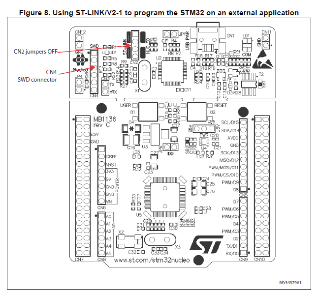

# STM32F103C8T6 (Blue Pill)

## Documents
- [Reference Manual for STM32F103xx](http://www.st.com/content/ccc/resource/technical/document/reference_manual/59/b9/ba/7f/11/af/43/d5/CD00171190.pdf/files/CD00171190.pdf/jcr:content/translations/en.CD00171190.pdf)

## Pinout

## Schematic

[Source](https://os.mbed.com/users/hudakz/code/STM32F103C8T6_Hello/)

---

## Creating new project in SW4STM32

1. `File` > `New` > `C Project`
	- Set project name
	- Choose `Ac6 STM32 MCU GCC`

2. Target Configuration 
	- Go to `Mcu` tab
	- Series: `STM32F1`
	- Mcu: `STM32F103C8Tx`

3. Firmware Configuration 
	- Choose `Cube HAL`
	- Check `Extract all firmware in separate folder`
	- Choose `As static external libraries`
	- Click `Finish`

4. Replace startup file
	- In some cases, the [correct startup file is not copied in automatically](https://community.st.com/thread/39138-where-are-irqhandler-functions-defined) by SW4STM32. This will cause interrupt vector functions to not work.
	- Copy `~/.ac6/SW4STM32/firmwares/STM32Cube_FW_F1_V1.6.0/Drivers/CMSIS/Device/ST/STM32F1xx/Source/Templates/gcc/startup_stm32f103x6.s` to `${project_dir}/startup/`

## Program with `st-flash` in command line 

	$ brew install stlink
	$ st-flash write hello_world.bin 0x8000000

## Using Nucleo Board as ST-Link programmer

1. Remove all jumpers from Nucleo CN2

2. Connect the following:

Function | Nucleo Board | Blue Pill
:---:  | :---: | :---:
SWCLK | Pin 2 (CN4) | Pin 2 (Debug)
SWDIO | Pin 4 (CN4) | Pin 3 (Debug)
RESET | Pin 5 (CN4) | R (I/O)
3V3 | 3V3 (CN6) | Pin 4 (Debug)
GND | GND (CN6) | Pin 1 (Debug)

More details:
- https://os.mbed.com/users/hudakz/code/STM32F103C8T6_Hello/

## Boot Modes

BOOT1 | BOOT0 | Mode
:---: | :---: | :---:
X | 0 | Flash memory
0 | 1 | Bootloader
1 | 1 | Embedded SRAM

> - Top: BOOT0
> - Bottom: BOOT1 

## Fix "Cannot connect to ST-LINK!" error

http://www.kerrywong.com/2012/08/02/the-dreaded-cannot-connect-to-st-link-error-message/

https://www.youtube.com/watch?v=jEz0C2bT2M0&app=desktop

https://forum.sparkfun.com/viewtopic.php?f=18&t=35249#wrap

https://electronics.stackexchange.com/questions/230036/problems-connecting-st-link-v2-and-stm32f4-discovery-board

